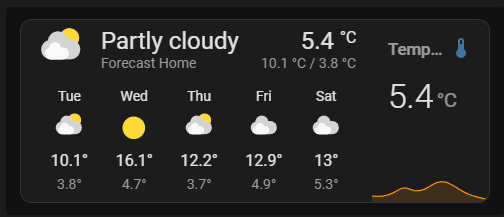

# Nested Lovelace Card


**Nested Lovelace Card** is a custom Lovelace card for Home Assistant that lets you group multiple cards into a single sleek card, stacked vertically or horizontally.


---

## About this fork

This is an actively maintained fork of the original [ofekashery/vertical-stack-in-card](https://github.com/ofekashery/vertical-stack-in-card), which has not seen updates in some time. Several bugs reported there have been fixed here.

The card element is still registered as `custom:vertical-stack-in-card` so **existing dashboards keep working without any changes**.

### Switching from the original

1. In HACS, add this repository as a custom repository (type: **Dashboard**):
   `https://github.com/Liquidmasl/nested-lovelace-card`
2. Install **Nested Lovelace Card** from there.
3. Remove the old **Vertical Stack In Card** entry.
4. Your existing dashboard YAML does not need to change.

---

## Configuration Options

| Name         | Type    | Default | Description                                       |
| ------------ | ------- | ------- | ------------------------------------------------- |
| `type`       | string  | N/A     | Must be `custom:vertical-stack-in-card`.          |
| `cards`      | list    | N/A     | List of cards to include.                         |
| `title`      | string  | None    | Optional. Title displayed at the top of the card. |
| `horizontal` | boolean | false   | Optional. Stack cards horizontally instead.       |
| `styles`     | object  | None    | Optional. Add custom CSS for advanced styling.    |

### Child card sizing with `grid_options`

You can control how much space each child card takes up by adding `grid_options` to it.

**Vertical stack — control height:**

```yaml
type: custom:vertical-stack-in-card
cards:
  - type: entities
    entities: [...]
    grid_options:
      rows: 2        # takes twice the space of a rows: 1 card
  - type: gauge
    entity: sensor.temperature
    grid_options:
      rows: 1
```

Cards without `rows` shrink to their natural content height. Cards with `rows` share the remaining space proportionally by their values. Height control only has a visible effect when the outer card has a fixed height allocated by the sections dashboard.

**Horizontal stack — control width:**



```yaml
type: custom:vertical-stack-in-card
horizontal: true
cards:
  - type: weather-forecast
    entity: weather.forecast_home
    forecast_type: daily
    grid_options:
      columns: 3
      rows: 2
  - type: custom:mini-graph-card
    entities:
      - sensor.outside_temp
```

`columns` values are used as relative flex weights. Cards without `columns` default to equal width.

## Installation

### Via HACS (recommended)

1. Open HACS in Home Assistant.
2. Go to **Frontend** → three-dot menu → **Custom repositories**.
3. Add `https://github.com/Liquidmasl/nested-lovelace-card` with type **Dashboard** as a custom repository.
4. Search for "Nested Lovelace Card" and install it.

### Manual Installation

Download [`nested-lovelace-card.js`](https://github.com/Liquidmasl/nested-lovelace-card/releases/latest/download/nested-lovelace-card.js) into your `<config>/www` directory.

```bash
wget https://github.com/Liquidmasl/nested-lovelace-card/releases/latest/download/nested-lovelace-card.js
mv nested-lovelace-card.js /config/www/
```

#### Add resource reference

If you configure Lovelace via YAML, add a reference in your `configuration.yaml`:

```yaml
resources:
  - url: /local/nested-lovelace-card.js?v=1.0.1
    type: js
```

Or via the UI: **Settings** → **Dashboards** → **Resources** → **Add resource**:

- **URL:** `/local/nested-lovelace-card.js?v=1.0.1`
- **Resource type:** `JavaScript Module`

## Usage

```yaml
type: 'custom:vertical-stack-in-card'
title: My Card
cards:
  - type: glance
    entities:
      - sensor.temperature_sensor
      - sensor.humidity_sensor
      - sensor.motion_sensor
  - type: entities
    entities:
      - switch.livingroom_tv
      - switch.livingroom_ac
      - light.ambient_lights
```

## Acknowledgements

Thanks to [@ofekashery](https://github.com/ofekashery) for the original [vertical-stack-in-card](https://github.com/ofekashery/vertical-stack-in-card), and to [@ciotlosm](https://github.com/ciotlosm) and [@thomasloven](https://github.com/thomasloven) for their inspiration and contributions.
